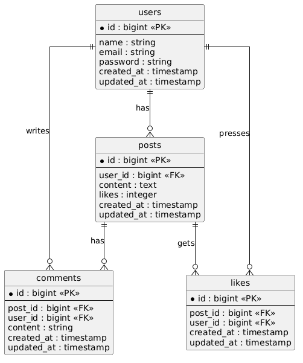

# SHARE

## アプリ概要

SHAREは、ユーザー登録・ログイン後に投稿、コメント、いいねができるSNS風アプリです。
フロントエンドはNuxt.js、バックエンドはLaravel APIで構成されています。

---

## 主な機能

* ユーザー新規登録
* ログイン / ログアウト
* 投稿作成
* 投稿一覧表示
* 投稿削除
* コメント投稿
* コメント削除
* いいね機能

---

## 使用技術（実行環境）

### フロントエンド

* Nuxt.js
* Vue.js
* JavaScript
* CSS

### バックエンド

* Laravel 8.83.29
* PHP 7.4.9
* SQLite

### 開発環境

* Docker
* Docker Compose
* Windows + WSL

---

## ER図



---

## テーブル設計

### users テーブル

| カラム名       | 型         | 説明      |
| ---------- | --------- | ------- |
| id         | bigint    | ユーザーID  |
| name       | string    | ユーザー名   |
| email      | string    | メールアドレス |
| password   | string    | パスワード   |
| created_at | timestamp | 作成日時    |
| updated_at | timestamp | 更新日時    |

### posts テーブル

| カラム名       | 型         | 説明         |
| ---------- | --------- | ---------- |
| id         | bigint    | 投稿ID       |
| user_id    | bigint    | 投稿者ID      |
| content    | text      | 投稿内容       |
| likes      | integer   | いいね数（初期構成） |
| created_at | timestamp | 作成日時       |
| updated_at | timestamp | 更新日時       |

### comments テーブル

| カラム名       | 型         | 説明        |
| ---------- | --------- | --------- |
| id         | bigint    | コメントID    |
| post_id    | bigint    | 対象投稿ID    |
| user_id    | bigint    | コメント投稿者ID |
| content    | string    | コメント内容    |
| created_at | timestamp | 作成日時      |
| updated_at | timestamp | 更新日時      |

### likes テーブル

| カラム名       | 型         | 説明          |
| ---------- | --------- | ----------- |
| id         | bigint    | いいねID       |
| post_id    | bigint    | 対象投稿ID      |
| user_id    | bigint    | いいねしたユーザーID |
| created_at | timestamp | 作成日時        |
| updated_at | timestamp | 更新日時        |

---

## API一覧

| メソッド | URL               | 機能      |
| ---- | ----------------- | ------- |
| POST | /api/register     | 新規登録    |
| POST | /api/login        | ログイン    |
| GET  | /api/posts        | 投稿一覧取得  |
| POST | /api/posts        | 投稿作成    |
| POST | /api/comments     | コメント投稿  |
| POST | /api/likes/toggle | いいね切り替え |

---

## 環境構築

### バックエンド（Laravel API）

#### 1. プロジェクトへ移動

```bash
cd share-api/src
```

#### 2. Docker起動

```bash
docker compose up -d --build
```

#### 3. Laravelコンテナへ入る（必要に応じて）

```bash
docker compose exec app sh
```

#### 4. マイグレーション実行

```bash
php artisan migrate
```

#### 5. Laravel API確認

```
http://127.0.0.1:8000
```

---

### フロントエンド（Nuxt.js）

#### 1. プロジェクトへ移動

```bash
cd share-front
```

#### 2. 起動

```bash
docker compose up -d
```

または

```bash
npm run dev
```

※ 環境に応じて使用してください。

#### 3. フロント確認

```
http://localhost:3000
```

---
