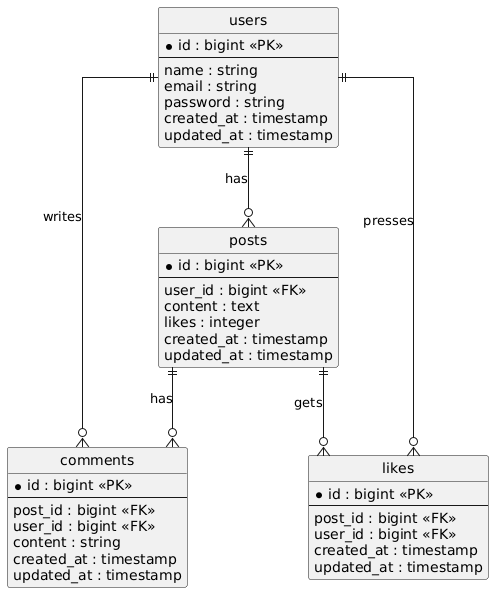

# SHARE

## アプリ概要

SHAREは、ユーザー登録・ログイン後に投稿、コメント、いいねができるSNS風アプリです。
フロントエンドはNuxt.js、バックエンドはLaravel APIで構成されています。

---

## 主な機能

- ユーザー新規登録
- ログイン / ログアウト
- 投稿作成
- 投稿一覧表示
- 投稿削除
- コメント投稿
- コメント削除
- いいね機能

---

## 使用技術（実行環境）

### フロントエンド

- Nuxt.js
- Vue.js
- JavaScript
- CSS

### バックエンド

- Laravel 8.83.29
- PHP 7.4.9
- SQLite

### 開発環境

- Docker
- Docker Compose
- Windows + WSL

---

## ER図



---

## テーブル設計

### users テーブル

| カラム名   | 型        | 説明           |
| ---------- | --------- | -------------- |
| id         | bigint    | ユーザーID     |
| name       | string    | ユーザー名     |
| email      | string    | メールアドレス |
| password   | string    | パスワード     |
| created_at | timestamp | 作成日時       |
| updated_at | timestamp | 更新日時       |

### posts テーブル

| カラム名   | 型        | 説明     |
| ---------- | --------- | -------- |
| id         | bigint    | 投稿ID   |
| user_id    | bigint    | 投稿者ID |
| content    | text      | 投稿内容 |
| likes      | integer   | いいね数 |
| created_at | timestamp | 作成日時 |
| updated_at | timestamp | 更新日時 |

### comments テーブル

| カラム名   | 型        | 説明             |
| ---------- | --------- | ---------------- |
| id         | bigint    | コメントID       |
| post_id    | bigint    | 対象投稿ID       |
| user_id    | bigint    | コメント投稿者ID |
| content    | string    | コメント内容     |
| created_at | timestamp | 作成日時         |
| updated_at | timestamp | 更新日時         |

### likes テーブル

| カラム名   | 型        | 説明                 |
| ---------- | --------- | -------------------- |
| id         | bigint    | いいねID             |
| post_id    | bigint    | 対象投稿ID           |
| user_id    | bigint    | いいねしたユーザーID |
| created_at | timestamp | 作成日時             |
| updated_at | timestamp | 更新日時             |

---

## API一覧

| メソッド | URL               | 機能           |
| -------- | ----------------- | -------------- |
| POST     | /api/register     | 新規登録       |
| POST     | /api/login        | ログイン       |
| GET      | /api/posts        | 投稿一覧取得   |
| GET      | /api/posts/{id}   | 投稿詳細取得   |
| POST     | /api/posts        | 投稿作成       |
| DELETE   | /api/posts/{id}   | 投稿削除       |
| POST     | /api/comments     | コメント投稿   |
| POST     | /api/likes/toggle | いいね切り替え |

---

## 環境構築

### バックエンド（Laravel API）

#### 1. リポジトリをclone

```bash
git clone git@github.com:sakanamax0/share-api.git
```

#### 2. プロジェクトへ移動

```bash
cd share-api
```

#### 3. 環境変数ファイルを作成

```bash
cp src/.env.example src/.env
```

#### 4. Dockerコンテナを起動

```bash
docker compose up -d --build
```

#### 5. Laravelコンテナへ入る

```bash
docker compose exec app sh
```

#### 6. Composer依存関係をインストール

```bash
composer install
```

#### 7. アプリケーションキーを作成

```bash
php artisan key:generate
```

#### 8. 設定キャッシュをクリア

```bash
php artisan config:clear
```

#### 9. マイグレーションを実行

```bash
php artisan migrate
```

#### 10. Laravel API動作確認

```text
http://127.0.0.1:8000
```

---

### フロントエンド（Nuxt.js）

#### 1. プロジェクトへ移動

```bash
cd share-front
```

#### 2. 起動

```bash
docker compose up -d
```

または

```bash
npm run dev
```

※ 環境に応じて使用してください。

#### 3. フロント確認

```text
http://localhost:3000
```

---

## Docker操作コマンド

### コンテナ停止方法

```bash
docker compose down
```

### 再起動方法

```bash
docker compose up -d
```

### 再ビルド方法

```bash
docker compose up -d --build
```

---

## .envの設定について

`.env.example` をコピーして `.env` を作成してください。

```bash
cp src/.env.example src/.env
```

必要に応じてDB設定などを変更してください。

---

## 権限エラーが発生した場合

Laravelのログ出力やキャッシュ関連で権限エラーが発生した場合は、以下を実行してください。

```bash
docker compose exec app sh
chmod -R 777 storage bootstrap/cache
```

---

## 動作確認用テストユーザー

| 名前  | メールアドレス                                | パスワード |
| ----- | --------------------------------------------- | ---------- |
| test1 | [test1@example.com](mailto:test1@example.com) | password   |
| test2 | [test2@example.com](mailto:test2@example.com) | password   |
| test3 | [test3@example.com](mailto:test3@example.com) | password   |

※ 必要に応じてSeederで作成してください。

---

## 再cloneによる動作確認推奨

GitHubへpush後、一度別フォルダへcloneして正常に起動できるか確認することを推奨します。

```bash
git clone git@github.com:sakanamax0/share-api.git

cd share-api

docker compose up -d --build

docker compose exec app sh

composer install

cp src/.env.example src/.env

php artisan key:generate

php artisan migrate
```
